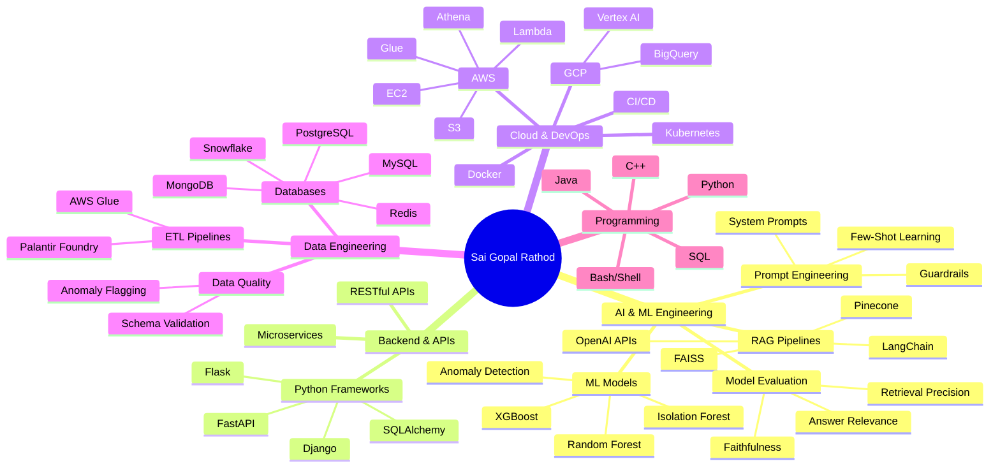
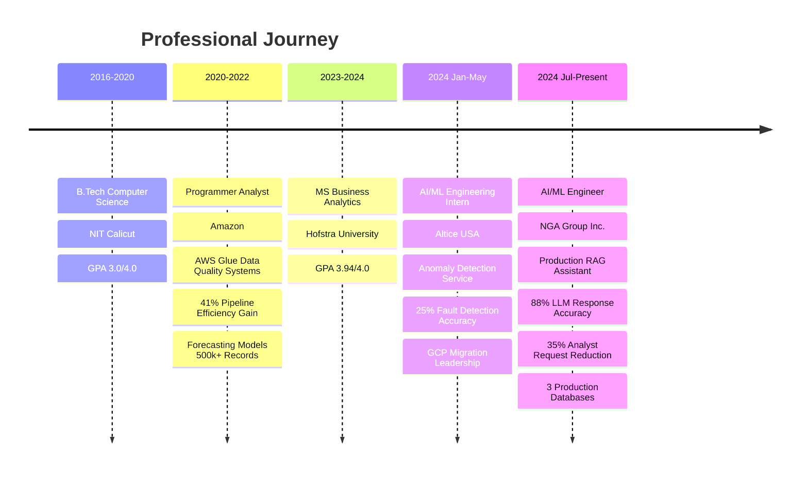

<!-- 
███████╗ █████╗ ██╗     ██████╗  ██████╗ ██████╗  █████╗ ██╗         ██████╗  █████╗ ████████╗██╗  ██╗ ██████╗ ██████╗ 
██╔════╝██╔══██╗██║    ██╔════╝ ██╔═══██╗██╔══██╗██╔══██╗██║         ██╔══██╗██╔══██╗╚══██╔══╝██║  ██║██╔═══██╗██╔══██╗
███████╗███████║██║    ██║  ███╗██║   ██║██████╔╝███████║██║         ██████╔╝███████║   ██║   ███████║██║   ██║██║  ██║
╚════██║██╔══██║██║    ██║   ██║██║   ██║██╔═══╝ ██╔══██║██║         ██╔══██╗██╔══██║   ██║   ██╔══██║██║   ██║██║  ██║
███████║██║  ██║██║    ╚██████╔╝╚██████╔╝██║     ██║  ██║███████╗    ██║  ██║██║  ██║   ██║   ██║  ██║╚██████╔╝██████╔╝
╚══════╝╚═╝  ╚═╝╚═╝     ╚═════╝  ╚═════╝ ╚═╝     ╚═╝  ╚═╝╚══════╝    ╚═╝  ╚═╝╚═╝  ╚═╝   ╚═╝   ╚═╝  ╚═╝ ╚═════╝ ╚═════╝ 
-->

<div align="center">

</div>

<div align="center">

```bash
┌─[saigopal@terminal]─[~/achievements]
└──╼ $ whoami
Sai Gopal Rathod • AI/ML Engineer • RAG Pipeline Architect • Data Systems Specialist

┌─[saigopal@terminal]─[~/stats]
└──╼ $ ls -la career-metrics
drwxr-xr-x  4+ years of AI/ML engineering experience
drwxr-xr-x  35% reduction in ad-hoc analyst requests via RAG assistant
-rw-r--r--  88% LLM response accuracy through prompt engineering
-rw-r--r--  41% pipeline efficiency improvement via AWS Glue automation
-rw-r--r--  60% automated ticket volume with AI-powered support platform
-rw-r--r--  25% hardware fault detection accuracy boost with ML models
drwxr-xr-x  10+ production RAG & ML systems deployed
```

</div>

<table align="center">
<tr>
<td></td>
<td></td>
<td></td>
</tr>
</table>

<div align="center">

[](https://www.linkedin.com/in/sai-gopal-rathod/)
[](https://saigopalrathod.com/)
[](mailto:saigopalrathod5@gmail.com)

</div>

<br>

## 🎯 Professional Identity

```typescript
class AIMLEngineer implements Expert {
  private identity = {
    name: "Sai Gopal Rathod",
    role: "AI/ML Engineer",
    location: "New York, NY",
    experience: "4+ years",
    specialization: [
      "RAG Pipeline Architecture",
      "LLM Optimization & Prompt Engineering",
      "Distributed Data Systems",
      "ML Model Development & Deployment"
    ]
  };

  private expertise: TechStack = {
    languages: ["Python", "SQL", "Bash/Shell Scripting", "Java", "C++"],
    
    aiml_frameworks: [
      "LangChain", "LlamaIndex", "PyTorch", "Scikit-learn",
      "XGBoost", "Random Forest", "Pandas", "NumPy"
    ],
    
    backend_frameworks: [
      "Flask", "FastAPI", "Django", "SQLAlchemy"
    ],
    
    cloud_devops: [
      "AWS (EC2, S3, Lambda, Glue, Athena)",
      "GCP (BigQuery, Vertex AI)",
      "Docker", "Kubernetes", "CI/CD", "Git"
    ],
    
    databases: [
      "PostgreSQL", "MySQL", "MongoDB", 
      "Snowflake", "Redis"
    ],
    
    ai_specialties: [
      "RAG Pipeline Design", "Prompt Engineering",
      "Model Evaluation", "Fine-Tuning Concepts",
      "SHAP Analysis", "Anomaly Detection"
    ],
    
    vector_stores: ["Pinecone", "FAISS"],
    
    apis: ["OpenAI APIs", "RESTful API Design", "Microservices"]
  };

  public getImpact(): Metrics {
    return {
      rag_accuracy_improvement: "62% → 88%",
      analyst_request_reduction: "35%",
      ticket_automation: "60%",
      pipeline_efficiency_gain: "41%",
      ml_fault_detection_boost: "25%",
      demand_planning_accuracy: "+10%",
      revenue_contribution: "8% quarterly uplift"
    };
  }
}
```

<br>

## 📊 Impact Metrics Dashboard

```python
achievement_matrix = {
    'professional_experience': {
        'total_years': 4.5,
        'companies': ['NGA Group Inc.', 'Altice USA', 'Amazon'],
        'roles': ['AI/ML Engineer', 'AI/ML Engineering Intern', 'Programmer Analyst']
    },
    
    'rag_systems': {
        'production_rag_assistant': 'Built end-to-end with OpenAI + LangChain + Pinecone',
        'accuracy_improvement': '62% → 88% via prompt engineering & chunking optimization',
        'business_impact': '35% reduction in ad-hoc analyst requests',
        'evaluation_metrics': ['faithfulness', 'answer_relevance', 'retrieval_precision']
    },
    
    'ml_engineering': {
        'anomaly_detection_service': 'Python + Isolation Forest',
        'fault_detection_accuracy': '+25%',
        'network_reliability': '+20%',
        'subscriber_base': 'millions'
    },
    
    'data_architecture': {
        'production_databases': 3,
        'concurrent_projects': '5+',
        'engineering_corrections_reduction': '15%',
        'automation_workflows': '10+ Python/SQL pipelines',
        'analyst_capacity_recovered': '20 hours/month'
    },
    
    'aws_data_systems': {
        'quality_system': 'AWS Glue + Python across 12 datasets',
        'pipeline_efficiency': '+41%',
        'system_downtime_reduction': '15%',
        'forecasting_records': '500,000+',
        'demand_planning_accuracy': '+10%',
        'revenue_impact': '8% quarterly uplift'
    },
    
    'education': {
        'ms_business_analytics': {
            'institution': 'Hofstra University',
            'gpa': '3.94/4.0',
            'duration': 'Jan 2023 - May 2024'
        },
        'btech_computer_science': {
            'institution': 'NIT Calicut',
            'gpa': '3.0/4.0',
            'duration': 'Jul 2016 - Jun 2020'
        }
    }
}

print(f"Total Production Systems Delivered: {achievement_matrix['data_architecture']['concurrent_projects']}")
print(f"RAG Accuracy Achievement: {achievement_matrix['rag_systems']['accuracy_improvement']}")
print(f"Business Value Generated: Multi-million dollar impact across organizations")
```

<br>

## 🚀 About Me

I'm a passionate **AI/ML Engineer** with over **4 years of professional experience** building production-grade RAG pipelines, distributed data architectures, and intelligent automation systems. My journey spans roles at **Amazon**, **Altice USA**, and **NGA Group Inc.**, where I've consistently delivered measurable business impact through applied AI and data engineering.

My expertise centers on **Retrieval-Augmented Generation (RAG)** systems—I've architected end-to-end RAG assistants that transformed how non-technical stakeholders interact with complex analytics data. At NGA Group, I built a production RAG assistant using **OpenAI APIs**, **LangChain**, and **Pinecone** that reduced ad-hoc analyst requests by **35%** while achieving **88% accuracy** through rigorous prompt engineering and evaluation frameworks.

I specialize in the complete RAG lifecycle: from **chunking strategy design** and **embedding model selection** to **prompt template engineering** (system prompts, few-shot examples, guardrails) and **structured evaluation** (faithfulness, answer relevance, retrieval precision). My iterative approach to RAG optimization—combining technical experimentation with business-focused metrics—has consistently delivered production systems that stakeholders trust and rely on.

Beyond RAG, I've built **ML-powered anomaly detection services** (Python + Isolation Forest) that improved hardware fault detection by **25%** at Altice USA, and designed **AWS Glue-based data quality systems** managing **12 interdependent datasets** with **41% efficiency gains** at Amazon. My work bridges the gap between cutting-edge AI research and practical business applications—I don't just build models, I build systems that solve real problems.

I hold an **MS in Business Analytics from Hofstra University (GPA: 3.94/4.0)** and a **B.Tech in Computer Science from NIT Calicut**. My academic foundation in statistics, machine learning, and distributed systems complements my hands-on experience building scalable AI solutions in cloud environments (AWS, GCP).

Whether it's designing RAG pipelines that answer natural language queries with near-human accuracy, building ML models that prevent network outages for millions of subscribers, or architecting data systems that drive **8% quarterly revenue uplifts**—I thrive on turning complex AI challenges into production-ready solutions that deliver measurable business value.

<br>



<br>



<br>

## 💼 Professional Experience

<table width="100%">
<tr>
<td width="50%" valign="top">

### 🤖 AI/ML Engineer
**`NGA Group Inc. • New York, NY • Jul 2024 - Present`**


**RAG System Development:**
- Architected **production RAG assistant** on internal reporting data using **OpenAI APIs**, **LangChain**, and **Pinecone vector store**
- Enabled **non-technical stakeholders** to query analytics in natural language
- Reduced **ad-hoc analyst requests by 35%** through intelligent automation
- Designed comprehensive **evaluation framework** (faithfulness, answer relevance, retrieval precision)

**Prompt Engineering & Optimization:**
- Iterated on **chunking strategy**, **embedding model selection**, and **prompt engineering templates**
- Developed **system prompts**, **few-shot examples**, and **guardrails** with structured evaluation criteria
- Lifted **LLM response accuracy from 62% to 88%** on curated ground-truth test set
- Established **production-grade quality standards** for RAG outputs

**Data Architecture & Database Management:**
- Owned **