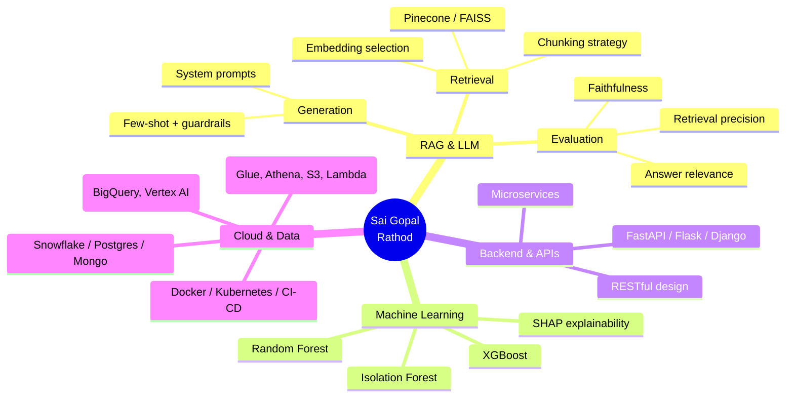
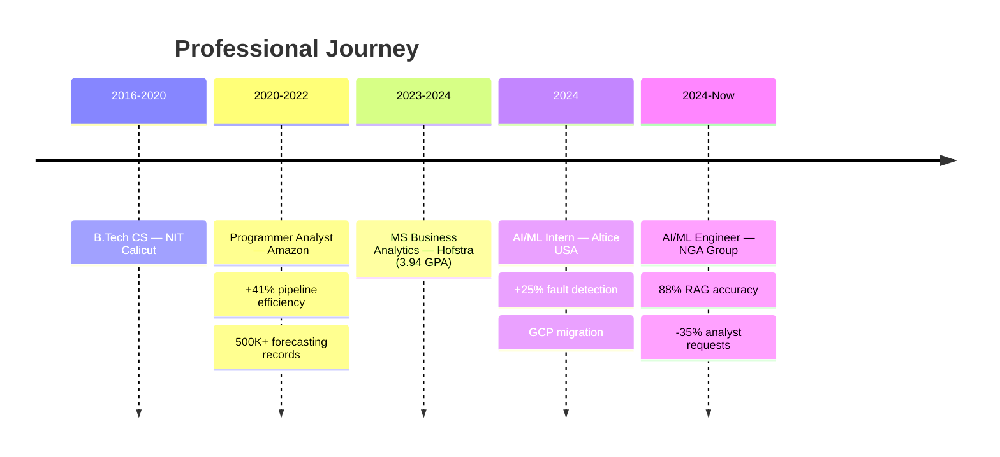

<!-- ╔═══════════════════════════ HEADER ═══════════════════════════╗ -->

<div align="center">
  
</div>

<div align="center">
  <a href="https://saigopalrathod.com/">
    
  </a>
</div>

<!-- ╔═══════════════════════════ SOCIALS ══════════════════════════╗ -->

<div align="center">

[](https://saigopalrathod.com/)
[](https://www.linkedin.com/in/sai-gopal-rathod/)
[](mailto:saigopalrathod.gre@gmail.com)
[](#)


&nbsp;
<a href="https://github.com/saigopal-rathod?tab=followers">
  
</a>

</div>

<br>

<!-- ╔════════════════════════ AT A GLANCE ═════════════════════════╗ -->

<div align="center">

> **AI/ML Engineer with 4+ years shipping production RAG pipelines, ML services, and cloud data systems at Amazon, Altice USA, and NGA Group.**
> I don't just train models — I build systems non-technical stakeholders rely on every day.

</div>

<table align="center">
  <tr>
    <td align="center"><b>🎯 88%</b><br><sub>RAG accuracy<br>(up from 62%)</sub></td>
    <td align="center"><b>📉 35%</b><br><sub>fewer ad-hoc<br>analyst requests</sub></td>
    <td align="center"><b>⚡ 41%</b><br><sub>pipeline efficiency<br>gain (AWS Glue)</sub></td>
    <td align="center"><b>🛡️ 25%</b><br><sub>fault-detection<br>accuracy lift</sub></td>
    <td align="center"><b>💰 8%</b><br><sub>quarterly revenue<br>uplift</sub></td>
  </tr>
</table>

<br>

## 🧩 Professional Identity

```typescript
class AIMLEngineer {
  readonly name        = "Sai Gopal Rathod";
  readonly role        = "AI/ML Engineer @ NGA Group Inc.";
  readonly based       = "New York, NY";
  readonly experience  = "4+ years";

  readonly focus = [
    "RAG Pipeline Architecture (chunking → retrieval → eval)",
    "LLM Optimization & Prompt Engineering",
    "ML Model Development & Anomaly Detection",
    "Distributed, cloud-native Data Systems",
  ] as const;

  shipImpact(): Record<string, string> {
    return {
      ragAccuracy:        "62% → 88%",
      analystRequests:    "-35%",
      ticketAutomation:   "60%",
      pipelineEfficiency: "+41%",
      faultDetection:     "+25%",
      demandPlanning:     "+10%",
      quarterlyRevenue:   "+8%",
    };
  }
}
```

<br>

## 🛠️ Tech Stack

<div align="center">

**Languages & Core**


**AI / ML / LLM**


&nbsp;


**Backend & APIs**


&nbsp;


**Cloud, Data & DevOps**


&nbsp;


**Databases**


</div>

<br>

## 📈 GitHub Analytics

<div align="center">


</div>

<br>

## 🚀 Featured Work

<table>
<tr>
<td width="50%" valign="top">

### 🔍 RAG Analytics Assistant
`OpenAI · LangChain · Pinecone · FastAPI`

End-to-end RAG assistant over internal reporting data that lets non-technical teams query analytics in plain English.

- **62% → 88%** answer accuracy on a curated ground-truth set
- **−35%** ad-hoc analyst requests
- Eval framework: *faithfulness · answer-relevance · retrieval-precision*

</td>
<td width="50%" valign="top">

### 🛡️ ML Anomaly Detection Service
`Python · Isolation Forest · SHAP`

Real-time hardware-fault detection across a subscriber base in the millions.

- **+25%** fault-detection accuracy
- **+20%** network reliability
- SHAP-driven explainability for on-call engineers

</td>
</tr>
<tr>
<td width="50%" valign="top">

### ⚙️ AWS Glue Data-Quality Platform
`AWS Glue · Athena · S3 · Python`

Automated quality + validation layer across **12 interdependent datasets**.

- **+41%** pipeline efficiency
- **−15%** system downtime
- Schema validation & anomaly flagging at ingest

</td>
<td width="50%" valign="top">

### 📊 Forecasting & Demand Engine
`Python · XGBoost · Snowflake`

Forecasting models over **500K+ records** feeding demand planning.

- **+10%** demand-planning accuracy
- **+8%** quarterly revenue uplift
- **20 hrs/month** of analyst capacity recovered

</td>
</tr>
</table>

> 💡 *Tip: swap any card above for a live pinned-repo card →*
> ``

<br>

## 💼 Experience

<details open>
<summary><b>🤖 AI/ML Engineer — NGA Group Inc. · New York, NY · Jul 2024 – Present</b></summary>

<br>

**RAG System Development**
- Architected a production RAG assistant on internal reporting data using OpenAI APIs, LangChain, and a Pinecone vector store
- Enabled non-technical stakeholders to query analytics in natural language → **−35%** ad-hoc analyst requests
- Designed an evaluation framework spanning faithfulness, answer relevance, and retrieval precision

**Prompt Engineering & Optimization**
- Iterated on chunking strategy, embedding-model selection, and prompt templates (system prompts, few-shot examples, guardrails)
- Lifted LLM response accuracy from **62% → 88%** on a curated ground-truth test set
- Established production-grade quality standards for RAG outputs

**Data Architecture & Database Management**
- Owned 3 production databases and 10+ Python/SQL automation pipelines
- Cut engineering corrections by **15%** and recovered **~20 analyst hours/month**

</details>

<details>
<summary><b>🧪 AI/ML Engineering Intern — Altice USA · Jan 2024 – May 2024</b></summary>

<br>

- Built a Python anomaly-detection service (Isolation Forest) → **+25%** hardware fault-detection accuracy, **+20%** network reliability for millions of subscribers
- Contributed to GCP migration leadership (BigQuery, Vertex AI)
- Automated AI-powered support workflows that handled **60%** of ticket volume

</details>

<details>
<summary><b>🧱 Programmer Analyst — Amazon · 2020 – 2022</b></summary>

<br>

- Built an AWS Glue + Python data-quality system across **12 datasets** → **+41%** pipeline efficiency, **−15%** downtime
- Developed forecasting models over **500K+ records** → **+10%** demand-planning accuracy, **+8%** quarterly revenue uplift

</details>

<br>

## 🎓 Education

| Degree | Institution | GPA | Period |
|:--|:--|:--:|:--:|
| **MS, Business Analytics** | Hofstra University | **3.94 / 4.0** | Jan 2023 – May 2024 |
| **B.Tech, Computer Science** | NIT Calicut | 3.0 / 4.0 | Jul 2016 – Jun 2020 |

<br>

## 🧠 How I Think About AI Systems



<br>



<br>

<!--
═══════════════════════════════════════════════════════════════════════════════
  OPTIONAL: contribution-snake animation
  The workflow at .github/workflows/snake.yml regenerates this daily.
  Run it once manually (Actions tab → Generate Snake → Run workflow) to
  populate it immediately.
═══════════════════════════════════════════════════════════════════════════════
-->

## 🐍 Contribution Graph

<div align="center">
  
</div>

<br>

<!-- ╔═══════════════════════════ FOOTER ═══════════════════════════╗ -->

<div align="center">

### 💬 Let's build something intelligent.

[](https://saigopalrathod.com/)
[](mailto:saigopalrathod.gre@gmail.com)


</div>
